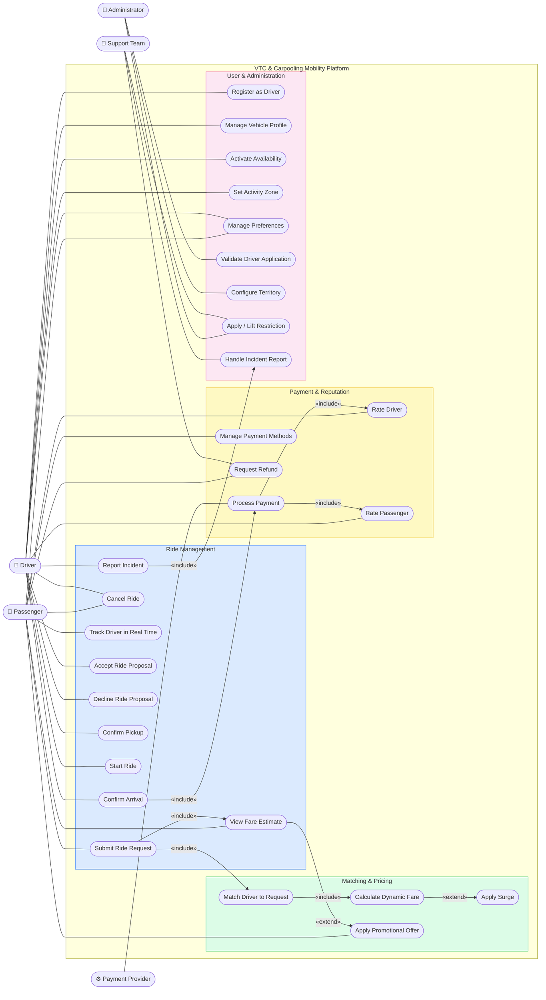

# UML Use Case Diagram — VTC & Carpooling Mobility Platform

## Actors

| Actor | Role |
|---|---|
| **Passenger** | Submits ride requests, manages payment and preferences, rates drivers |
| **Driver** | Accepts/declines proposals, manages availability and vehicle profile, rates passengers |
| **Administrator** | Configures territories, validates driver applications, manages restrictions |
| **Support Team** | Handles incident reports, processes refunds, applies restrictions |
| **Payment Provider** | External system (e.g. Stripe) that processes financial transactions |

## Relationship Legend

| Notation | Meaning |
|---|---|
| `«include»` | The base use case always triggers the included use case |
| `«extend»` | The extending use case is triggered only under certain conditions |
| `───` | Association between actor and use case |
